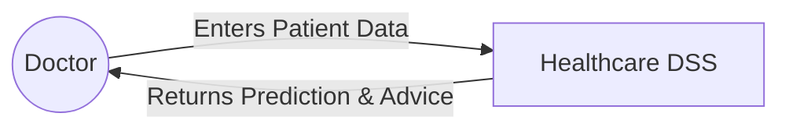
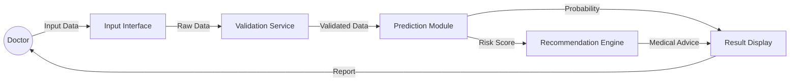
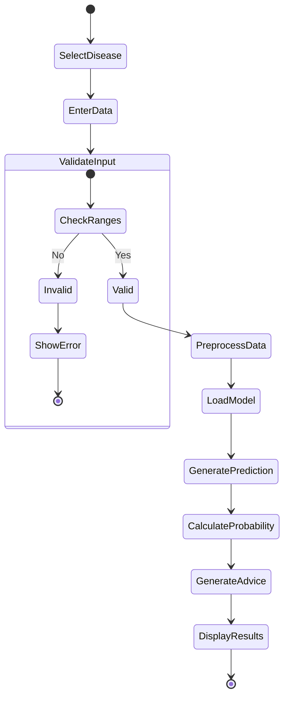

# System Architecture & Diagrams

## 1. System Architecture
The system follows a standard Client-Server architecture with a decoupled ML inference engine.

```mermaid
graph TD
    Client[Client Browser (React App)]
    API[FastAPI Backend Server]
    ML[ML Inference Engine]
    Models[(Trained Models .pkl)]
    Data[(Data Processing Pipeline)]

    Client -- HTTPS/JSON --> API
    API -- Input Data --> ML
    ML -- Load --> Models
    ML -- Preprocess --> Data
    ML -- Prediction --> API
    API -- Response --> Client
```

## 2. Data Flow Diagram (DFD) - Level 0



## 3. Data Flow Diagram (DFD) - Level 1



## 4. Activity Diagram (Prediction Workflow)



## 5. Technology Stack
| Component | Technology | Description |
|-----------|------------|-------------|
| **Frontend** | React.js | Component-based UI library |
| **Styling** | Tailwind CSS | Utility-first CSS framework |
| **Backend** | FastAPI | High-performance Python web framework |
| **ML Libraries** | Scikit-learn, XGBoost | Model training and inference |
| **Data Processing** | Pandas, NumPy | Data manipulation and analysis |
| **Serialization** | Pickle | Model persistence |
| **Validation** | Pydantic | Data validation and settings management |
